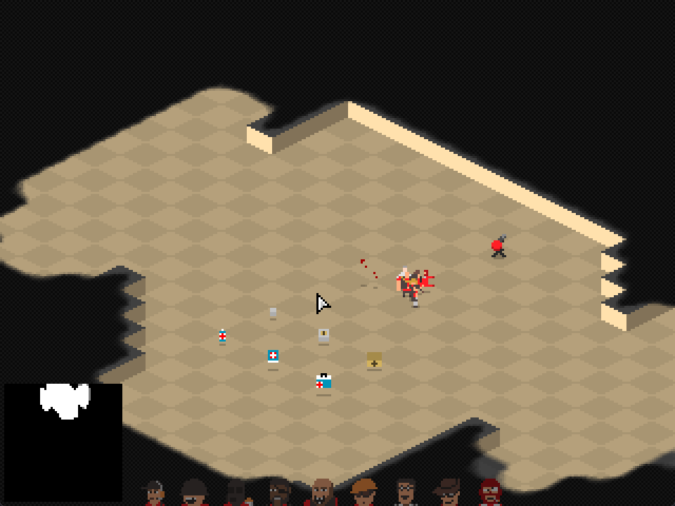
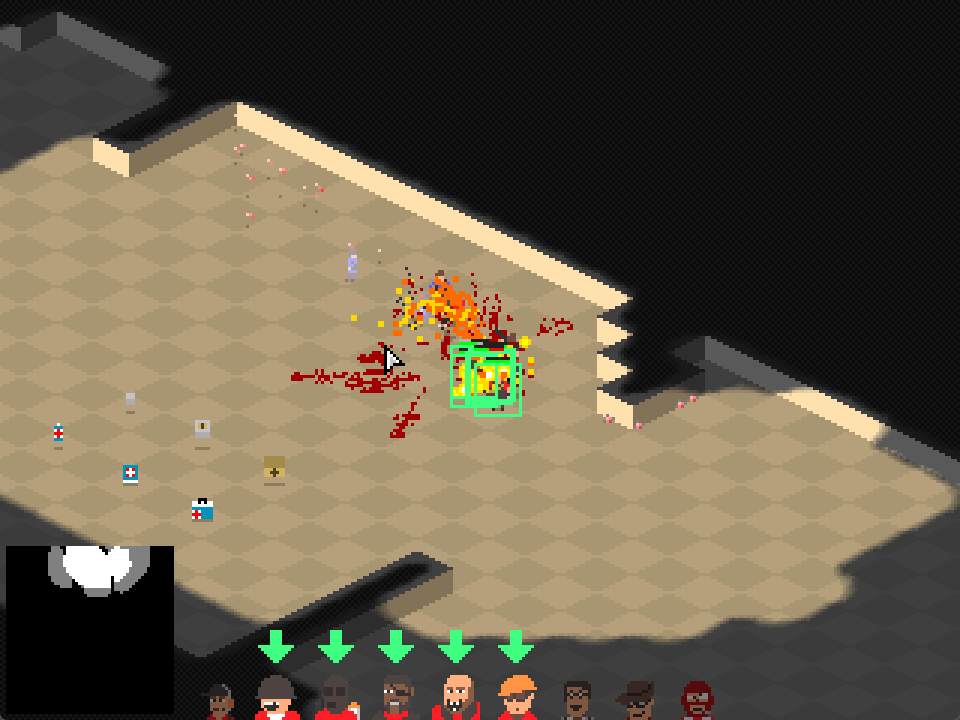

# Dittany

Dittany is a small isometric real-time strategy and automatic-combat prototype written in plain Java with AWT/Swing. It combines RTS controls—unit selection, drag selection, movement orders, camera scrolling, a minimap, and fog of war—with class-based shooter combat. Red and BLU field nine distinct unit classes inspired by familiar team-shooter roles: Scout, Soldier, Pyro, Demoman, Heavy, Engineer, Medic, Sniper, and Spy.

The player commands the red team. Units navigate the tile map, acquire hostile targets, aim, fire, reload, take damage, collect health or ammunition, die, and respawn. The BLU team is AI-controlled. Combat includes hitscan-like projectiles, rockets, sticky bombs, flames, healing beams, explosions, knockback, debris, shadows, and blood effects.





This is a prototype rather than a complete commercial game. There are no menus, campaign, networking, save games, or polished victory conditions yet. Its compact codebase makes it useful as a starting point for experimenting with RTS mechanics, software rendering, isometric projection, simple AI, pathfinding, weapons, and particle effects.

## Controls

| Action | Input |
| --- | --- |
| Select one friendly unit | Left-click it |
| Clear the current selection | Left-click empty ground |
| Select several units | Left-button drag around them |
| Issue a movement order | Right-click the destination |
| Pan the camera | `WASD` or arrow keys |
| Drag the camera | Hold and drag the middle mouse button |
| Select a class | `1`–`9`, numpad layout, or `R T Y / F G H / V B N` |
| Cycle classes | `Q` and `E`/`Tab` |
| Center on a unit | Select its class again |
| Pause/open settings | `Esc` |

Units engage enemies automatically when a target is within their weapon range.

The ESC menu pauses the simulation and provides runtime controls for window scale (`1×`–`5×`) and the in-game FPS display, plus Resume and Quit actions. Gameplay uses the same bitmap font for selected-unit names, health values, group-selection counts, and FPS text.

## Building and running

The repository is a Gradle project and includes the Gradle wrapper, so a separate Gradle installation is unnecessary. The project officially targets Java 26.

On Windows:

```console
.\gradlew.bat build
.\gradlew.bat run
```

On Linux or macOS:

```bash
./gradlew build
./gradlew run
```

Source code lives in `src/main/java`; sprite sheets, map data, and other classpath resources live in `src/main/resources`.

## Creating the Windows application

Build a self-contained Windows application image with:

```console
.\gradlew.bat --no-daemon clean build packageExe
```

The result is written to `dist/Dittany-<version>`. Distribute that entire directory, not only the executable. It contains `Dittany.exe`, the game JAR, resources, native support files, and a Java runtime, so players do not need Java installed. Distributions live outside Gradle's temporary `build` directory, allowing `gradlew clean` to work while a packaged copy of the game is running.

Packaging requires a full JDK 26 containing `jpackage`. WiX is not required because this task creates a portable application directory rather than an installer.

To also produce a shareable archive, add the `zip` property:

```console
.\gradlew.bat packageExe -Pzip
```

This additionally writes `dist/Dittany-<version>.zip` containing the complete application directory, ready to send to other players.

## How the game is structured

The engine deliberately avoids external game frameworks. A small number of types form the main pipeline:

| Area | Main types | Responsibility |
| --- | --- | --- |
| Window and loop | `Dittany` | Creates the Swing window, runs fixed 60 Hz ticks, renders to a low-resolution framebuffer, and scales it to the window |
| Input | `InputHandler`, `Input` | Converts AWT keyboard and mouse events into per-tick button, release, and typed states |
| Player interaction | `PlayerView`, `Player` | Camera movement, selection, orders, minimap, class bar, and visibility state |
| World | `Game`, `Level` | Owns the simulation, map, teams, entities, particles, collision index, fog, and render passes |
| Rendering | `Bitmap`, `Sprite`, `Art` | Pixel framebuffer operations, isometric projection, sprite sorting, sprite-sheet loading, shadows, and fog blending |
| GUI | `gui` package | Nested panels, images, buttons, and value bars rendered directly through `Bitmap` |
| Actors | `Entity`, `Unit`, `Mob` | Movement, collision, health, teams, targeting, orders, animation, death, and respawning |
| Behavior | `Order`, `MoveOrder`, `HuntOrder`, `IdleOrder` | Pluggable unit goals and path-following behavior |
| Combat | `Weapon` and subclasses | Ammo, timing, range, aiming, reloading, and projectile creation |
| Effects | `Bullet`, other entities, `particle` package | Damage, explosions, flames, healing beams, smoke, blood, meat, and other transient visuals |

### Tick and render flow

`Dittany` runs simulation updates at 60 ticks per second. Each tick updates the world through `Game.tick()` and then updates player controls through `PlayerView.tick()`. Rendering is separate:

1. `PlayerView.render()` asks `Game` to render the visible world.
2. `Level.renderBg()` draws isometric floor and wall tiles.
3. A shadow mask is rendered and applied to the framebuffer.
4. Visible entities, particles, and map sprites are depth-sorted and drawn.
5. Fog-of-war masks cover unseen or remembered territory.
6. Selection boxes, minimap, class bar, and cursor are drawn in screen space.

The logical framebuffer is `320 × 240` pixels and is scaled by `3` for display. Keeping simulation rendering at the low resolution is what gives the game its crisp pixel-art appearance.

### Coordinates and isometric projection

Entities exist in world space as `x`, `y`, and `z`. `Sprite` projects them to the screen using:

```java
int screenX = (int) Math.floor((x - y) * Sprite.SCALE_X);
int screenY = (int) Math.floor((x + y) * Sprite.SCALE_Y - z);
```

`Bitmap.xOffs` and `Bitmap.yOffs` hold the negative camera position while the world is rendered. UI rendering should reset both offsets to zero so controls remain fixed to the screen.

## Rendering with `Bitmap`

`Bitmap` is the software framebuffer and image type. Pixels are packed ARGB integers such as `0xff00ff00` for opaque green. Its essential operations are:

- `clear(color)` fills the complete bitmap.
- `setPixel(x, y, color)` writes one clipped pixel.
- `fill(x0, y0, x1, y1, color)` draws a filled rectangle.
- `box(x0, y0, x1, y1, color)` draws a rectangle outline.
- `draw(bitmap, x, y)` copies opaque pixels from another bitmap.
- `blendDraw(bitmap, x, y, color)` draws a sprite blended with a tint.
- `shade(mask)`, `blend(...)`, and `fogBlend(...)` implement world lighting and fog effects.

Rectangle endpoints are inclusive. For example, `fill(0, 0, 9, 9, color)` fills a `10 × 10` region. `draw` treats pixels with the high alpha bit set as drawable, so normal sprite pixels should use fully opaque ARGB values and transparent sprite pixels should have alpha zero.

### Example: a simple HUD panel

This example draws a panel, border, health bar, and an existing class portrait. Call it near the end of `PlayerView.render()` after world rendering:

```java
private void drawHud(Bitmap screen, Mob unit) {
    // UI is screen-relative, not affected by the world camera.
    screen.xOffs = 0;
    screen.yOffs = 0;

    int x = 8;
    int y = 8;
    int width = 104;
    int height = 28;

    screen.fill(x, y, x + width - 1, y + height - 1, 0xff20242a);
    screen.box(x, y, x + width - 1, y + height - 1, 0xffd8d8d8);

    if (unit == null) {
        return;
    }

    // The class portrait is already cut into Bitmaps by Art.
    Bitmap portrait = Art.i.red[0][unit.unitClass];
    screen.draw(portrait, x + 4, y + 6);

    int barX = x + 24;
    int barY = y + 9;
    int barWidth = 72;
    int healthWidth = barWidth * unit.health / unit.maxHealth;

    screen.fill(barX, barY, barX + barWidth - 1, barY + 5, 0xff601818);
    if (healthWidth > 0) {
        screen.fill(barX, barY, barX + healthWidth - 1, barY + 5, 0xff30c050);
    }
    screen.box(barX, barY, barX + barWidth - 1, barY + 5, 0xffffffff);
}
```

Use it from `PlayerView.render()` like this:

```java
drawHud(screen, player.getSelectedUnit());
```

Text is rendered by `BitmapFont` from two sheets with the same printable-ASCII layout. `font.png` supplies the large 16-pixel HUD glyphs, while `font8x8.png` supplies native 8-pixel settings and FPS glyphs without lossy resizing. Both sheets contain 19 columns and 5 rows covering space through `~`; the first cell is intentionally empty. `GuiLabel` wraps rendered text in a regular `GuiImage`.

### Using the GUI package

The `de.cirrus.dittany.gui` package supplies a deliberately small retained GUI model matching the rest of the engine:

- `GuiComponent` holds position, size, visibility, enabled state, and parent-relative coordinates.
- `GuiContainer` owns child components and forwards ticks and rendering.
- `GuiPanel` is a colored, optionally bordered container.
- `GuiImage` draws a `Bitmap`.
- `GuiLabel` renders text from the bundled bitmap-font sheet.
- `GuiButton` exposes polled `hovered`, `down`, and `clicked` state.
- `GuiProgressBar` draws a bounded value such as health or ammunition.
- `SettingsMenu` composes these controls into the ESC pause menu.

State is public and behavior is polled, like `Input`, `Sprite`, and the other original engine classes. Gameplay code therefore remains in its owner instead of being hidden inside GUI callbacks.

For example, a small selected-unit panel can be assembled once after `Art.init()`:

```java
private GuiPanel hud;
private GuiProgressBar healthBar;
private GuiButton unitButton;

private void initGui() {
    hud = new GuiPanel(8, 8, 112, 34);

    healthBar = new GuiProgressBar(28, 10, 76, 6);
    hud.add(healthBar);

    unitButton = new GuiButton(4, 6, 20, 20, Art.i.red[0][0]);
    hud.add(unitButton);
}
```

Update it during the owning view's tick:

```java
hud.tick(input);

Mob selected = player.getSelectedUnit();
if (selected != null) {
    healthBar.max = selected.maxHealth;
    healthBar.value = selected.health;
    unitButton.icon = Art.i.red[0][selected.unitClass];
}

if (unitButton.clicked) {
    centerOn(selected);
}
```

Render it after the world and reset the camera offsets first:

```java
screen.xOffs = 0;
screen.yOffs = 0;
hud.render(screen);
```

If a panel overlaps the playable world, check `hud.contains(input.x, input.y)` before processing world clicks so the same click does not also select a unit or issue an order.

### Example: a reusable button

`Bitmap` only draws pixels; input remains in `Input`. A tiny immediate-mode button can combine both:

```java
private boolean drawButton(Bitmap screen, Input input,
        int x, int y, int width, int height, Bitmap icon) {
    boolean hovered = input.x >= x && input.x < x + width
            && input.y >= y && input.y < y + height;

    int background = hovered ? 0xff586878 : 0xff303840;
    int border = hovered ? 0xffffffff : 0xffa0a8b0;

    screen.fill(x, y, x + width - 1, y + height - 1, background);
    screen.box(x, y, x + width - 1, y + height - 1, border);
    screen.draw(icon, x + (width - icon.w) / 2, y + (height - icon.h) / 2);

    return hovered && input.b0Clicked;
}
```

For a menu system, keep input handling in `tick()` and drawing in `render()` rather than allowing rendering to mutate gameplay state. The example returns a click for compactness; a larger UI should store button state during the tick and only visualize it during rendering.

## Expanding the game

### Add or change artwork

Place PNG files below `src/main/resources`. Load complete images with `Art.load("/path.png")` or regular sprite sheets with `Art.loadAndCut("/sheet.png", tileWidth, tileHeight)`. Resource paths begin with `/` because they are loaded from the root of the runtime classpath.

For example:

```java
public Bitmap button = load("/ui/button.png");
public Bitmap[][] icons = loadAndCut("/ui/icons.png", 8, 8);
```

Keep each sheet’s dimensions divisible by its cell dimensions. The returned array is indexed `[column][row]`.

### Add a unit class

A unit class normally extends `Mob`, assigns its stats and weapon, and receives its owning `Player`:

```java
public final class Ranger extends Mob {
    public Ranger(Player player) {
        super(9, player);
        maxHealth = health = 150;
        speed = 110;
        visRange = 12;
        weapon = new Revolver(this);
    }
}
```

To make a tenth class fully playable, also extend the class constants and `Mob.create`, provide a sprite-sheet row for both teams, change the spawn and class-selection loops from nine entries, add an input binding, and expand the class bar. At present several parts of the prototype intentionally assume exactly nine classes.

### Add a weapon

Extend `Weapon`, configure ammunition and timing in the constructor, then override `shoot` to create projectiles or apply an effect. `Scattergun` is a concise example: it consumes one shell, creates multiple `Bullet` objects with random spread, adds them to the level, and starts its firing cooldown.

```java
public final class BurstWeapon extends Weapon {
    public BurstWeapon(Mob owner) {
        super(owner);
        ammoLoaded = maxAmmoLoaded = 12;
        ammoCarried = maxAmmoCarried = 48;
        shootDelayTime = 0.25;
        maxRange = 180;
    }

    @Override
    public void shoot(double xa, double ya, double za) {
        super.shoot(xa, ya, za);
        owner.level.add(new Bullet(owner, this, xa, ya, za, 12));
        shootDelay = shootDelayTime;
    }
}
```

Study the rocket launcher, flamethrower, sticky launcher, minigun, sniper rifle, and Medi Gun before adding special behavior; they demonstrate the existing projectile and effect patterns.

### Add a pickup or world entity

Extend `Entity` for general world objects or `Pickup` for collectible items. Implement `tick`, `render`, collision behavior, and removal as needed, then call `level.add(entity)`. `HealthPickup` and `AmmoPickup` demonstrate reusable pickup behavior.

### Add an order or AI behavior

Extend `Order` and implement:

- `init(Mob)` to capture the unit and initialize pathfinding or state.
- `tick()` to advance the behavior once per simulation tick.
- `finished()` to tell the unit when it should request another order.

Assign it with `mob.setOrder(new YourOrder(...))`. Human movement uses `MoveOrder`; AI-controlled units fall back to `HuntOrder`; inactive human units use `IdleOrder`.

### Edit or replace the map

`Level` loads `src/main/resources/levels/level.png` as both map geometry and placement data, then adds a four-tile blocked border. Each image pixel represents one logical tile:

| Pixel color | Meaning |
| --- | --- |
| `#000000` | Blocked wall tile |
| Other unrecognized colors | Walkable floor |
| `#808080`, `#A0A0A0`, `#C0C0C0` | Small, medium, or large ammunition pickup |
| `#8080FF`, `#A0A0FF`, `#C0C0FF` | Small, medium, or large health pickup |

The current movement and pathfinding code assumes a `64 × 64` logical navigation grid in several places. If you change the map dimensions substantially, replace those hard-coded dimensions with `level.w` and `level.h` throughout pathfinding, minimap generation, and travel-cost arrays.

### Add game states and menus

The cleanest next architectural step is a `GameState` interface with `tick()` and `render(Bitmap)` methods. `Dittany` can hold the active state while menu, gameplay, pause, and results screens each own their input and rendering. This avoids growing `Dittany` and `PlayerView` into a single controller for unrelated screens.

## Good next improvements

- Add JUnit tests for coordinate transforms, selection, map decoding, damage, and order completion.
- Replace fixed `64 × 64` assumptions with level dimensions.
- Continue separating UI widgets from `PlayerView` as the HUD grows.
- Add explicit match objectives, win/loss state, restart, and pause screens.
- Move unit/class definitions into data files so new classes do not require edits across several switch-like sections.
- Add formation movement and prevent selected units from converging on exactly one point.
- Improve target prioritization, line-of-sight checks, and team AI.
- Add audio, settings, key rebinding, and scalable/fullscreen presentation.
- Seed or inject random-number generators for deterministic tests and replays.

## Project layout

```text
src/main/java/de/cirrus/dittany/
├── ai/          pathfinding
├── entity/      projectiles, base entities, and pickups
├── gui/         minimal Bitmap-based GUI components
├── level/       map, collision index, visibility, shadows, and minimap
├── particle/    combat and environmental effects
├── unit/        unit base classes and the nine playable classes
├── weapon/      weapon implementations
├── Bitmap.java  software framebuffer operations
├── Dittany.java window, loop, and presentation
├── Game.java    top-level world simulation
└── PlayerView.java controls, camera, selection, and HUD

src/main/resources/
├── chars/       red and BLU character sheets
├── levels/      color-encoded level image
└── *.png        tiles, cursors, particles, pickups, missiles, and panel art
```
